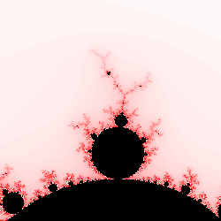
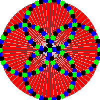
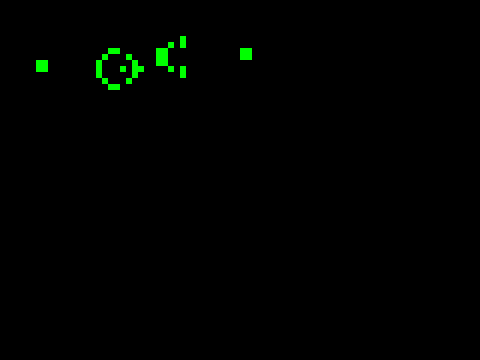
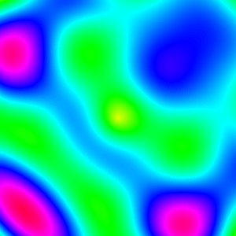
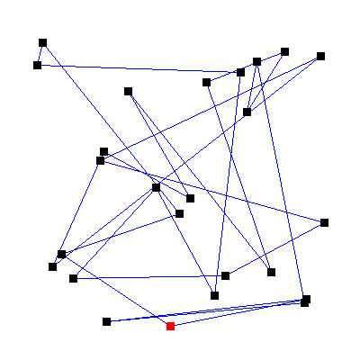
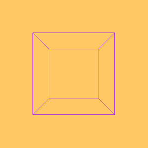
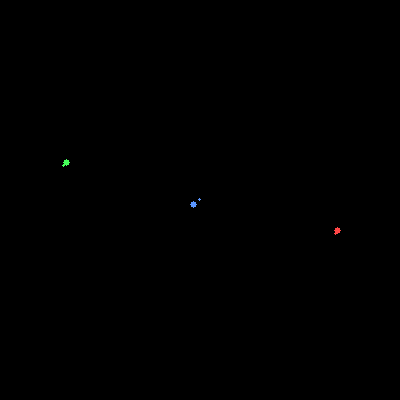
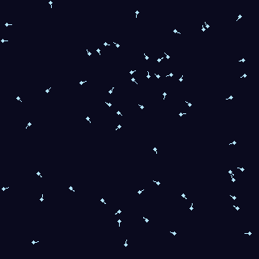
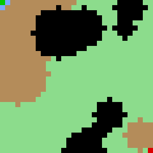
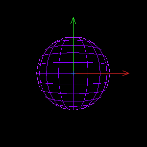

[](https://github.com/jacobwilliams/FGIF/releases/latest)
[](https://github.com/jacobwilliams/FGIF/actions)
[](https://codecov.io/gh/jacobwilliams/FGIF)
[](https://github.com/jacobwilliams/FGIF/commits/master)

FGIF: Create Animated GIFs with Fortran

## Description

Just a simple module that can be used to create GIFs and animated GIFs with Fortran.
Based on the public domain code at: http://fortranwiki.org/fortran/show/writegif

## Compiling

A `fpm.toml` file is provided for compiling `fgif` with the [Fortran Package Manager](https://github.com/fortran-lang/fpm). For example, to build:

```
  fpm build --profile release --flag "-fopenmp"
```

And to run the unit tests:

```
  fpm test --profile release --flag "-fopenmp"
```

To use `fgif` within your fpm project, add the following to your `fpm.toml` file:
```toml
[dependencies]
fgif = { git="https://github.com/jacobwilliams/fgif.git" }
```

## Documentation

The latest API documentation can be found [here](http://jacobwilliams.github.io/FGIF/). This was generated from the source code using [FORD](https://github.com/Fortran-FOSS-Programmers/ford).

## Examples

### Mandelbrot



### Circle illusion


### Game of Life


### Plasma


### Traveling Salesman Problem


### Maze generation and solving


### Rotating wireframe cube


### L-system plant growth


### N-body gravity simulation


### Falling sand


### Boids flocking simulation


### A* pathfinding


### Rotating wireframe sphere

